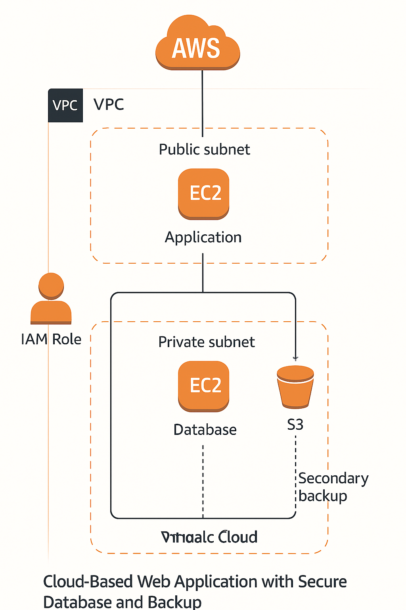

# aws-windows-ec2-backup-project
# 🛡️ AWS Windows EC2 Backup Project

This project demonstrates a real-world cloud automation use case: **automatic MySQL database backup from a Windows EC2 instance to Amazon S3**, using AWS CLI, IAM Role, and PowerShell scripting.

---

## 📦 Project Overview

This repository contains:
- A step-by-step process of setting up the environment
- PowerShell script for automated backup
- Architecture diagram explaining the complete setup

---

## 🔧 AWS Services Used

| Service     | Purpose                                     |
|-------------|---------------------------------------------|
| EC2 (Windows) | Host the MySQL server and backup script   |
| S3          | Store backup files                         |
| IAM         | Manage access between EC2 and S3            |
| VPC         | Isolated network environment                |
| Security Group | Control access via RDP (port 3389)       |

---

## 📁 Repository Structure

| File/Folder                 | Description                              |
|----------------------------|------------------------------------------|
| `powerShall_Script.txt`    | PowerShell script for DB backup to S3    |
| `Process.txt`              | Steps followed during project setup      |
| `AWS_Project_process_diagram.png` | Cloud architecture diagram        |
| `README.md`                | This file                                |

---

## 🧪 How It Works

1. A Windows EC2 instance hosts the MySQL server
2. PowerShell script creates a `.sql` dump of the database
3. The dump is uploaded to a specific S3 bucket using AWS CLI
4. IAM Role allows EC2 to access S3 securely
5. (Optional) Scheduled Task in Windows triggers daily backup

---

## 🖼️ Architecture Diagram

---

## 🚀 Future Enhancements

- Replace EC2 with **Amazon RDS**
- Add **CloudWatch monitoring and alerts**
- Encrypt backup files before S3 upload
- Set **S3 lifecycle rules** to move backups to Glacier

---

## 🙋‍♂️ Author

**Deepak Prajapat**  
Cloud & Data Science Enthusiast  
GitHub: [@divyanshprajapati011](https://github.com/divyanshprajapati011)

---

> 📢 *Feel free to fork, star ⭐ this repo, or raise an issue if you want to collaborate!*
